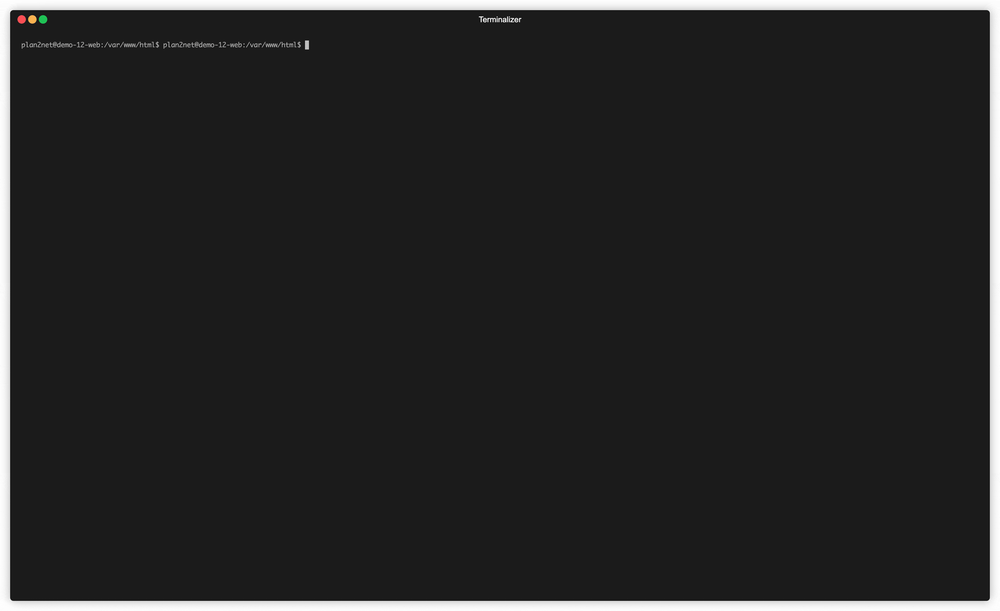

# TYPO3 Update Check

[](https://github.com/plan2net/typo3-update-check/actions/workflows/ci.yml)
[](https://github.com/plan2net/typo3-update-check/releases)
[](https://packagist.org/packages/plan2net/typo3-update-check)
[](https://github.com/plan2net/typo3-update-check/blob/main/LICENSE)
[](https://packagist.org/packages/plan2net/typo3-update-check)

A Composer plugin that intercepts TYPO3 core updates and displays breaking changes and security updates before proceeding.

## Purpose and motivation

When updating TYPO3, it's easy to overlook critical changes buried in release notes and announcements. Even minor version updates can introduce breaking changes or important security fixes that require immediate attention. Traditionally, developers need to manually check release announcements, security advisories, and changelogs—a time-consuming process that's often skipped under deadline pressure.

This Composer plugin solves this problem by bringing important information directly to your terminal, exactly when and where you need it. During the update process, it automatically highlights breaking changes (⚠️) and security updates (⚡), ensuring you never miss critical changes that could impact your application's functionality or security.

## Installation

```bash
composer require --dev plan2net/typo3-update-check
```

**Note:** This plugin should only be installed as a development dependency since it's only useful during development when running `composer update`. Production deployments typically use `composer install` with locked versions. If you choose to install it in production environments, you do so at your own risk.

## How it works

The plugin automatically activates during `composer update` and:

1. **Detects TYPO3 core updates** - Monitors when `typo3/cms-core` is being updated
2. **Fetches release information** - Retrieves data from the TYPO3 API for all versions between current and target
3. **Analyzes security bulletins** - Fetches severity levels (Critical, High, Medium, Low) from security advisories
4. **Displays important changes** - Shows only versions with breaking changes or security updates, including severity summary
5. **Requests confirmation** - Prompts before proceeding with updates that contain breaking changes

## Example output



```
TYPO3 core will be updated from 12.4.10 to 12.4.15
Fetching version information...

Changes in version 12.4.11:
Breaking changes found:
  ⚠️ [BREAKING] Introduce type declarations in AbstractDatabaseRecordList
  ⚠️ [BREAKING] Introduce type declarations in QueryView

Changes in version 12.4.15:
Security updates found (1 High, 2 Medium):
  ⚡ [SECURITY] Protect frame GET parameter in tx_cms_showpic eID
  ⚡ [SECURITY] Encode all file properties in tx_cms_showpic output
  ⚡ [SECURITY] Prevent XSS in FormManager backend module

Security advisories:
  - https://typo3.org/security/advisory/typo3-core-sa-2024-008
  - https://typo3.org/security/advisory/typo3-core-sa-2024-009
  - https://typo3.org/security/advisory/typo3-core-sa-2024-010

Release announcement: https://typo3.org/article/typo3-12415-security-release

⚠️ Breaking changes or security updates were found. Do you want to continue with the update? [y/N]
```

## Non-interactive mode

In non-interactive environments (CI/CD), the plugin will display information but automatically proceed with the update.

## Manual check

Once installed, you can manually check for breaking changes and security updates between any two versions:

```bash
composer typo3:check-updates 12.4.10 12.4.20
```

This is useful for planning upgrades or reviewing changes without actually performing an update.

## Security severity information

When security updates are detected, the plugin automatically fetches severity information from TYPO3 security bulletins and displays a summary:

- **Severity levels**: Critical, High, Medium, Low

This helps developers quickly assess the urgency of security updates without manually checking each bulletin.

## API availability

If the TYPO3 API is temporarily unavailable, the plugin will display an error message but allow the update to proceed. This ensures that temporary API issues don't block your development workflow.

## Caching

The plugin caches API responses to improve performance and reduce load on the TYPO3 API servers:

- **Cache location**: Uses Composer's global cache directory (`~/.cache/composer` on Linux/macOS, `%LOCALAPPDATA%\Composer` on Windows)
- **Cache duration**: 
  - Release lists: 1 hour (automatically refreshed)
  - Release content: Permanent (version content never changes)
  - Security bulletins: Permanent (bulletin content never changes)
- **Shared cache**: Works across all TYPO3 projects on the same machine
- **Automatic cleanup**: Expired cache entries are automatically removed

The caching system ensures fast subsequent runs while keeping release information up-to-date.

## Development

### Setup
```bash
composer install
```

### Testing
```bash
composer test
```

### Code quality
```bash
composer analyse
composer cs-fix
```

## Requirements

- PHP 8.1+
- Composer 2.0+

## License

GPL-2.0+
