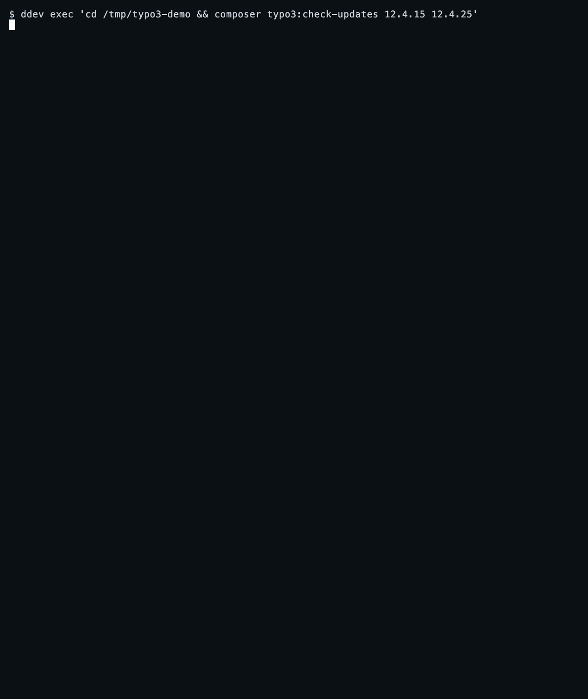

# TYPO3 Update Check

[](https://github.com/plan2net/typo3-update-check/actions/workflows/ci.yml)
[](https://packagist.org/packages/plan2net/typo3-update-check)
[](https://packagist.org/packages/plan2net/typo3-update-check)
[](https://github.com/plan2net/typo3-update-check/blob/main/LICENSE)
[](https://packagist.org/packages/plan2net/typo3-update-check)

A Composer plugin that intercepts TYPO3 core updates and displays breaking changes and security updates before proceeding.

## Purpose

Breaking changes and security fixes are easy to overlook when updating TYPO3. This plugin brings that information directly to your terminal the moment you run `composer update`, highlighting breaking changes (⚠️) and security updates (⚡) so you can make an informed decision before proceeding.

## Installation

```bash
composer require --dev plan2net/typo3-update-check
composer config allow-plugins.plan2net/typo3-update-check true
```

> [!NOTE]
> Composer 2.2+ requires plugins to be explicitly trusted. The second command adds the necessary entry to your `composer.json`. When running `composer require` interactively, Composer will prompt you to allow the plugin — answering yes has the same effect.

> [!WARNING]
> Install this plugin as a development dependency only. It is only useful during development when running `composer update`; production deployments typically use `composer install` with locked versions. If you choose to install it in production environments, you do so at your own risk.

## How it works

The plugin automatically activates during `composer update` and:

1. **Detects TYPO3 core updates** — Monitors when `typo3/cms-core` is being updated
2. **Fetches release information** — Retrieves data from the TYPO3 API for all versions between current and target
3. **Matches security advisories** — Determines fixed vulnerabilities per release from the Packagist security-advisories API (the same data source as composer audit), including CVE numbers and severity levels (critical, high, medium, low)
4. **Displays important changes** — Shows each affected version's breaking changes and security updates, followed by a one-line digest (releases scanned, security updates with severity totals, breaking changes)
5. **Warns about skipped security fixes** — If the target lands below newer security releases, it lists them so you can raise your constraint
6. **Requests confirmation** — Prompts before proceeding when breaking changes or security updates are found

In non-interactive environments (CI/CD), the plugin displays information but proceeds automatically. If the TYPO3 API is temporarily unavailable, the update continues without interruption.

## Major version upgrades

Cross-major updates (e.g. 12.4 → 13.4) are fully supported. Since a major upgrade path contains hundreds of breaking changes, the report switches to a condensed format:

- A banner announces the upgrade with links to the official upgrade guide and the changelog of every crossed major
- Breaking changes appear as a per-release count (e.g. `13.0.0: ⚠️ 207 breaking changes`) instead of a full list — security updates keep their complete detail (CVEs, severities, bulletins)
- Updates within a major line keep the detailed format as before
- A major upgrade always asks for confirmation in interactive shells, even when release information could not be fetched
- Jumping more than one major at once (e.g. 12 → 14) prints an additional warning, since TYPO3 officially supports upgrading one major version at a time

## Example output


## Manual check

You can check for breaking changes and security updates between any two versions without running an actual update:

```bash
composer typo3:check-updates 13.4.10 13.4.12
```

Both arguments are optional. With no arguments it uses your installed `typo3/cms-core` version and the latest release in that line; with only the first it defaults the target to the latest:

```bash
composer typo3:check-updates             # installed version → latest release
composer typo3:check-updates 13.4.10     # 13.4.10 → latest release
composer typo3:check-updates 12.4.10 13.4.5   # across major versions
```

> [!NOTE]
> Defaults always stay within the installed major line — a cross-major check happens only when you pass the target explicitly. For an unknown cross-major target, the command offers the latest release of the requested major's line.

When a version is auto-detected or defaulted, the command asks for confirmation before checking. If you pass a target that doesn't exist, it offers the latest instead; an unknown current version (or missing versions in a non-interactive shell) is rejected with a hint.



## Disabling the check

Set the environment variable `TYPO3_UPDATE_CHECK=0` to skip the check, for a single run or permanently in environments where it is not wanted:

```bash
TYPO3_UPDATE_CHECK=0 composer update
```

The values `0`, `false`, `off`, and `no` (case-insensitive) are recognized. The manual `typo3:check-updates` command is not affected.

## API availability

The plugin tolerates transient TYPO3 API issues automatically:

- **Transient errors:** connection failures and HTTP 5xx responses are
  retried by Composer's own HTTP transport where it supports that
  (Composer ≥ 2.3 with ext-curl). On older Composer versions or the
  PHP-streams fallback, requests get a single attempt.
- **Rate limiting:** HTTP 429 responses are retried by the plugin itself —
  up to two retries with exponential backoff (1 s, 2 s), honoring the
  server's `Retry-After` header capped at 5 s.
- **No retry on deterministic errors:** HTTP 4xx responses other than
  429 are treated as final and reported immediately.
- **Per-version reporting:** when only some versions fail to fetch,
  the others are still shown. Each failure is categorized — network
  error, server error, not found, or malformed response — and the
  plugin suggests retrying with `composer typo3:check-updates` for the
  skipped versions.
- **Fail-soft:** if every request fails, the plugin reports the dominant
  failure category and lets the update proceed so your development
  workflow is never blocked.

Downloads run through Composer's HTTP layer, so its parallelism setting
(`COMPOSER_MAX_PARALLEL_HTTP`, default 12) applies.


## Caching

API responses are cached to improve performance and reduce load on TYPO3 servers:

- **Location** — Composer's global cache directory (`~/.cache/composer` on Linux/macOS, `%LOCALAPPDATA%\Composer` on Windows)
- **Release lists** — 1 hour
- **Release content** — Permanent (content never changes)
- **Security advisories** — 1 hour

The cache is shared across all TYPO3 projects on the same machine.

## Requirements

- PHP 8.1+
- Composer 2.0+
- No third-party runtime dependencies (uses Composer's own HTTP layer)

## License

GPL-2.0+
